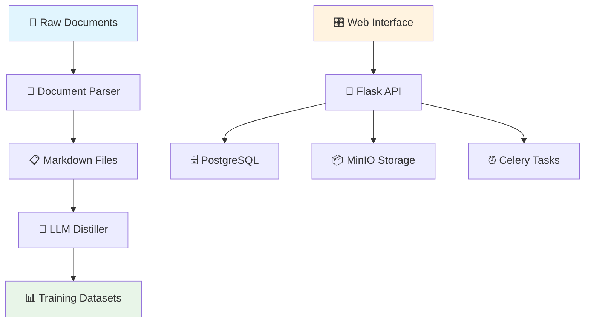

<div align="center">

# 🔮 PinData

[](README.md) | [](README_CN.md)

*An intelligent dataset management platform for LLM training data*


[🚀 Quick Start](#-quick-start) •
[📖 Documentation](#-documentation) •
[🎯 Use Cases](#-use-cases) •
[🏗️ Architecture](#️-architecture) •
[🤝 Contributing](#-contributing)

</div>

---

## ✨ What is PinData?


PinData is a **modern, open-source dataset management platform** designed specifically for large language model (LLM) training workflows. It simplifies the process of converting raw documents into structured training datasets, supporting document-to-markdown conversion and intelligent dataset generation.

### 🎯 Why PinData?

- **📚 Multi-Format Support**: Process DOCX, PPTX, PDF files with intelligent text extraction to Markdown
- **🤖 Smart Dataset Generation**: Convert processed content into training-ready formats using LLM integration
- **📊 Git-Style Versioning**: Complete dataset lineage tracking with version comparison and rollback
- **🔗 Multi-Platform Integration**: Support for HuggingFace, ModelScope, and other data platforms
- **🚀 Production Ready**: Built with Docker, Celery, and modern web technologies for scalability

---

## 🎯 Use Cases

### 🏢 Enterprise AI Teams
- **Document Knowledge Base**: Convert company documentation, manuals, and reports into training datasets
- **Compliance & Quality**: Ensure data quality with built-in cleaning and validation pipelines
- **Version Control**: Track dataset evolution and maintain data provenance for audit requirements

### 🎓 Academic Research
- **Literature Analysis**: Process research papers and academic documents for literature review datasets
- **Multi-Language Corpus**: Build specialized datasets for domain-specific language models
- **Reproducible Research**: Share and replicate dataset preparation workflows

### 🚀 AI Startups
- **Rapid Prototyping**: Quickly transform raw content into training-ready formats
- **Custom Fine-Tuning**: Create specialized datasets for domain-specific model training
- **Cost-Effective Scaling**: Self-hosted solution with no per-document processing fees

---

## 🏗️ Architecture



### Core Components

| Component | Technology | Purpose |
|-----------|------------|---------|
| **Frontend** | React 18 + TypeScript | Modern, responsive user interface |
| **API Layer** | Flask + SQLAlchemy | RESTful API with ORM |
| **Task Queue** | Celery + Redis | Async processing for long-running tasks |
| **Storage** | MinIO + PostgreSQL | Object storage + metadata management |
| **Document Processing** | MarkItDown + LangChain | Document parsing and LLM integration |

---

## 🚀 Quick Start

### Prerequisites
- 🐳 Docker 20.10+ and Docker Compose 1.29+
- 💾 4GB+ available RAM
- 📁 2GB+ available disk space

### One-Command Setup

```bash
# Clone the repository
git clone https://github.com/yourusername/pindata.git
cd pindata

# Start all services
docker-compose up -d

# Access the application
open http://localhost:3000
```

### Your First Dataset in 3 Steps

1. **📁 Upload Documents**: Drag and drop your DOCX, PPTX, or PDF files to create a library
2. **📝 Convert to Markdown**: Process documents into clean, structured Markdown files
3. **🎯 Generate Dataset**: Use LLM-powered distillation to create training-ready datasets

---

## 💡 Key Features

### 📄 Document to Markdown Conversion
- **Multi-Format Support**: Process DOCX, PPTX, PDF files using MarkItDown
- **Clean Text Extraction**: Intelligent parsing with structure preservation
- **Batch Processing**: Handle multiple documents efficiently with async tasks

### 🤖 LLM-Powered Dataset Generation
- **Smart Distillation**: Convert markdown content into training datasets using LLM APIs
- **Multiple Providers**: Support for OpenAI, Google Gemini, Anthropic Claude
- **Custom Formats**: Generate datasets in various formats (Alpaca, plain text, JSON)

### 📊 Dataset Management & Versioning
- **Version Control**: Git-style dataset versioning with complete lineage tracking
- **Multi-Platform Support**: Integration with HuggingFace Datasets, ModelScope
- **Library Organization**: Manage document collections and derived datasets

### 🔌 Extensible Architecture (In Development)
```python
# Future: Create custom distillers
class MyCustomDistiller(BaseDistiller):
    def distill(self, content, config):
        # Your custom processing logic
        return processed_data
```

---

## 🛠️ Development

### Local Development Setup

```bash
# Backend development
cd backend
python -m venv venv
source venv/bin/activate  # Windows: venv\Scripts\activate
pip install -r requirements.txt
cp config.example.env .env
python run.py

# Frontend development (new terminal)
cd frontend
npm install
npm run dev

# Celery worker (new terminal)
cd backend
./start_celery.sh
```

### Current Development Focus

The project is actively developing core features:
- Document parsing and markdown conversion
- LLM integration for dataset generation  
- Dataset versioning and management
- Multi-platform data source integration

---

## 📊 Roadmap

### 🎯 Current Version (1.0)
- ✅ Document parsing (DOCX, PPTX, PDF) to Markdown
- ✅ LLM-powered dataset generation
- ✅ Dataset versioning and management
- ✅ Web-based interface
- ✅ Multi-platform data integration (HuggingFace, ModelScope)

### 🚧 Next Release (1.1)
- 🔄 Enhanced PDF processing with OCR support
- 📤 Advanced dataset export/import capabilities
- 🔌 Plugin system for custom processors
- 📈 Data quality analytics dashboard
- 🔍 Advanced search and filtering

### 🌟 Future Vision
- 🖼️ Multi-modal data support (images, audio)
- 🤖 AI-assisted data cleaning and enhancement
- ☁️ Cloud-native deployment options
- 👥 Team collaboration features
- 🔗 Enhanced ML platform integrations

---

## 🤝 Contributing

We welcome contributions from the community! Whether you're fixing bugs, adding features, or improving documentation, your help makes PinData better for everyone.

### Ways to Contribute
- 🐛 **Bug Reports**: Found an issue? Let us know!
- ✨ **Feature Requests**: Have an idea? We'd love to hear it!
- 💻 **Code Contributions**: Submit pull requests for fixes and features
- 📚 **Documentation**: Help improve our docs and examples
- 🧪 **Testing**: Help test new features and integrations

### Getting Started
1. Fork the repository
2. Create a feature branch (`git checkout -b feature/amazing-feature`)
3. Commit your changes (`git commit -m 'Add amazing feature'`)
4. Push to the branch (`git push origin feature/amazing-feature`)
5. Open a Pull Request

---

## 📄 License

PinData is open source software licensed under the [Apache License 2.0](LICENSE).

---

## 🌟 Star History

[](https://star-history.com/#yourusername/pindata&Date)

---

<div align="center">

**Made with ❤️ by the PinData Team**

[⭐ Star us on GitHub](https://github.com/yourusername/pindata)

</div>