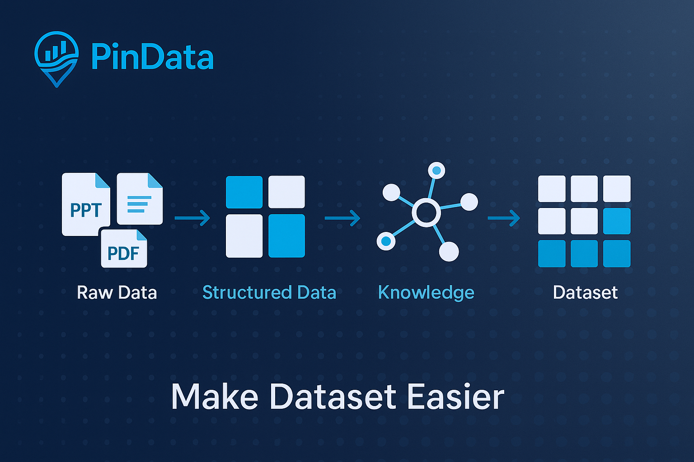
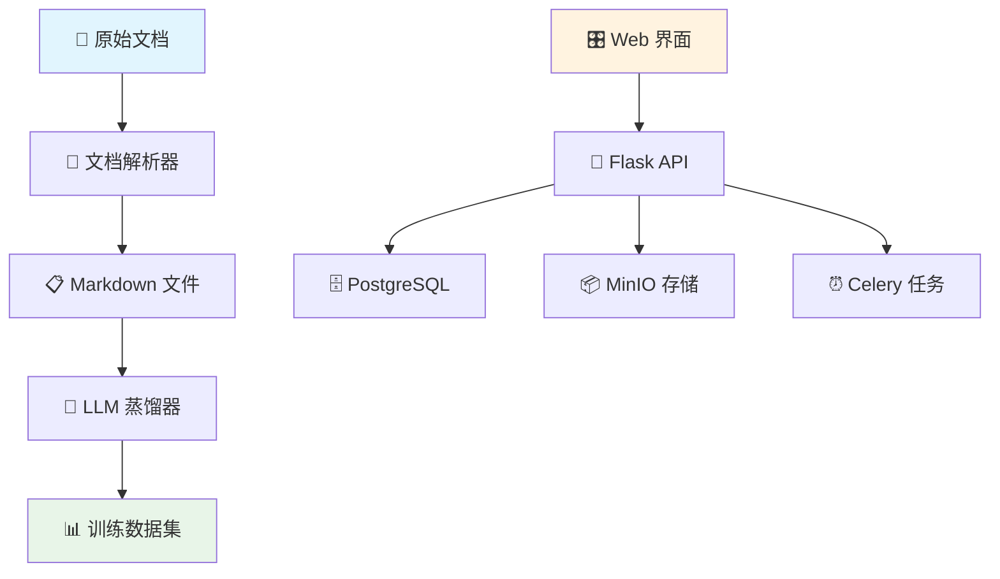

<div align="center">

# 🔮 PinData

[](README.md) | [](README_CN.md)

*面向大语言模型训练数据的智能数据集管理平台*


[🚀 快速开始](#-快速开始) •
[📖 文档说明](#-文档说明) •
[🎯 使用场景](#-使用场景) •
[🏗️ 系统架构](#️-系统架构) •
[🤝 参与贡献](#-参与贡献)

</div>

---

## ✨ 什么是 PinData？



PinData 是一个专为大语言模型（LLM）训练工作流设计的**现代化开源数据集管理平台**。它简化了将原始文档转换为结构化训练数据集的过程，支持文档到 Markdown 的转换和智能数据集生成。

### 🎯 为什么选择 PinData？

- **📚 多格式支持**：智能处理 DOCX、PPTX、PDF 文件，提取高质量文本转为 Markdown
- **🤖 智能数据集生成**：通过 LLM 集成将处理后的内容转换为训练就绪格式
- **📊 Git 风格版本控制**：完整的数据集血缘追踪，支持版本比较和回滚
- **🔗 多平台集成**：支持 HuggingFace、ModelScope 和其他数据平台
- **🚀 生产就绪**：基于 Docker、Celery 和现代 Web 技术构建，具备扩展性

---

## 🎯 使用场景

### 🏢 企业 AI 团队
- **文档知识库**：将公司文档、手册和报告转换为训练数据集
- **合规与质量**：通过内置清洗和验证流水线确保数据质量
- **版本控制**：追踪数据集演进并维护数据来源，满足审计要求

### 🎓 学术研究
- **文献分析**：处理研究论文和学术文档，构建文献综述数据集
- **多语言语料库**：为特定领域语言模型构建专业数据集
- **可重现研究**：共享和复制数据集准备工作流程

### 🚀 AI 初创公司
- **快速原型开发**：快速将原始内容转换为训练就绪格式
- **自定义微调**：为特定领域模型训练创建专业数据集
- **成本效益扩展**：自托管解决方案，无按文档处理费用

---

## 🏗️ 系统架构



### 核心组件

| 组件 | 技术栈 | 功能 |
|------|--------|------|
| **前端界面** | React 18 + TypeScript | 现代化响应式用户界面 |
| **API 层** | Flask + SQLAlchemy | RESTful API 与 ORM |
| **任务队列** | Celery + Redis | 长时间运行任务的异步处理 |
| **存储系统** | MinIO + PostgreSQL | 对象存储 + 元数据管理 |
| **文档处理** | MarkItDown + LangChain | 文档解析和 LLM 集成 |

---

## 🚀 快速开始

### 前置条件
- 🐳 Docker 20.10+ 和 Docker Compose 1.29+
- 💾 4GB+ 可用内存
- 📁 2GB+ 可用磁盘空间

### 一键启动

```bash
# 克隆仓库
git clone https://github.com/hikariming/pindata.git
cd pindata

# 启动所有服务
cd docker
docker-compose up -d

# 访问应用
open http://localhost:3000
```

### 3 步创建您的第一个数据集

1. **📁 上传文档**：拖拽您的 DOCX、PPTX 或 PDF 文件创建文档库
2. **📝 转换为 Markdown**：将文档处理为干净、结构化的 Markdown 文件
3. **🎯 生成数据集**：使用 LLM 驱动的蒸馏功能创建训练就绪的数据集

---

## 💡 核心功能

### 📄 文档到 Markdown 转换
- **多格式支持**：使用 MarkItDown 处理 DOCX、PPTX、PDF 文件
- **智能文本提取**：智能解析并保持结构完整性
- **批量处理**：通过异步任务高效处理多个文档

### 🤖 LLM 驱动的数据集生成
- **智能蒸馏**：使用 LLM API 将 markdown 内容转换为训练数据集
- **多供应商支持**：支持 OpenAI、Google Gemini、Anthropic Claude
- **自定义格式**：生成各种格式的数据集（Alpaca、纯文本、JSON）

### 📊 数据集管理与版本控制
- **版本控制**：Git 风格的数据集版本管理，完整血缘追踪
- **多平台支持**：与 HuggingFace Datasets、ModelScope 集成
- **文档库组织**：管理文档集合和衍生数据集

### 🔌 可扩展架构（开发中）
```python
# 未来：创建自定义蒸馏器
class MyCustomDistiller(BaseDistiller):
    def distill(self, content, config):
        # 您的自定义处理逻辑
        return processed_data
```

---

## 🛠️ 开发指南

### 本地开发环境搭建

```bash
# 后端开发
cd backend
python -m venv venv
source venv/bin/activate  # Windows: venv\Scripts\activate
pip install -r requirements.txt
cp config.example.env .env
python run.py

# 前端开发（新终端）
cd frontend
npm install
npm run dev

# Celery 工作进程（新终端）
cd backend
./start_celery.sh
```

### 当前开发重点

项目正在积极开发核心功能：
- 文档解析和 markdown 转换
- LLM 集成数据集生成
- 数据集版本管理
- 多平台数据源集成

---

## 📊 发展路线图

### 🎯 当前版本 (1.0)
- ✅ 文档解析（DOCX、PPTX、PDF）到 Markdown
- ✅ LLM 驱动的数据集生成
- ✅ 数据集版本管理
- ✅ Web 界面
- ✅ 多平台数据集成（HuggingFace、ModelScope）

### 🚧 下一版本 (1.1)
- 🔄 增强的 PDF 处理与 OCR 支持
- 📤 高级数据集导出/导入功能
- 🔌 自定义处理器插件系统
- 📈 数据质量分析仪表板
- 🔍 高级搜索和过滤

### 🌟 未来愿景
- 🖼️ 多模态数据支持（图像、音频）
- 🤖 AI 辅助数据清洗和增强
- ☁️ 云原生部署选项
- 👥 团队协作功能
- 🔗 增强的 ML 平台集成

---

## 🤝 参与贡献

我们欢迎社区贡献！无论您是修复错误、添加功能还是改进文档，您的帮助都让 PinData 变得更好。

### 贡献方式
- 🐛 **错误报告**：发现问题？请告诉我们！
- ✨ **功能请求**：有好想法？我们很乐意听到！
- 💻 **代码贡献**：为修复和功能提交拉取请求
- 📚 **文档完善**：帮助改进我们的文档和示例
- 🧪 **测试**：帮助测试新功能和集成

### 开始贡献
1. Fork 仓库
2. 创建功能分支（`git checkout -b feature/amazing-feature`）
3. 提交您的更改（`git commit -m 'Add amazing feature'`）
4. 推送到分支（`git push origin feature/amazing-feature`）
5. 开启 Pull Request

---

## 📄 许可证

PinData 是在 [Apache License 2.0](LICENSE) 下发布的开源软件。

---

## 🌟 Star 历史

[](https://star-history.com/#yourusername/pindata&Date)

---

<div align="center">

**由 PinData 团队用 ❤️ 制作**

[⭐ 在 GitHub 上给我们 Star](https://github.com/yourusername/pindata)

</div>
