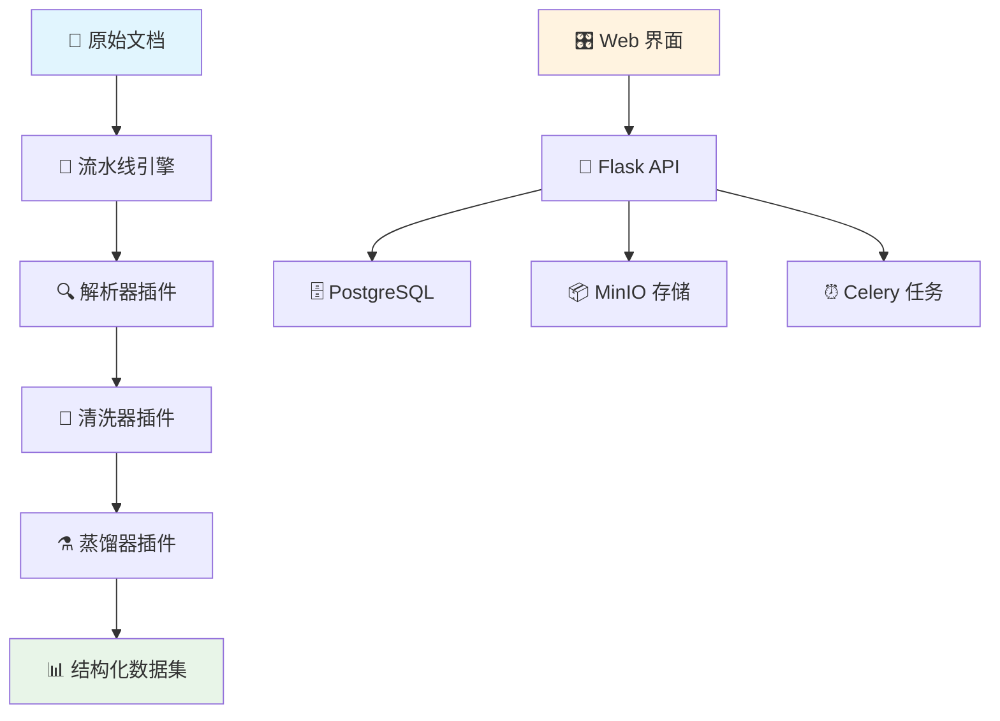

<div align="center">

# 🔮 PinData

[](README.md) | [](README_CN.md)

*面向大语言模型的智能数据集管理平台*


[🚀 快速开始](#-快速开始) •
[📖 文档说明](#-文档说明) •
[🎯 使用场景](#-使用场景) •
[🏗️ 系统架构](#️-系统架构) •
[🤝 参与贡献](#-参与贡献)

</div>

---

## ✨ 什么是 PinData？

PinData 是一个专为大语言模型（LLM）训练工作流设计的**现代化开源数据集管理平台**。它通过直观的流水线方法，将从原始文档到结构化训练数据的复杂准备过程变得简单高效。

### 🎯 为什么选择 PinData？

- **📚 多格式支持**：智能处理 DOCX、PPTX、PDF 文件，提取高质量文本
- **🔌 插件生态系统**：可扩展架构，支持自定义解析器、清洗器和蒸馏器
- **📊 Git 风格版本控制**：完整的数据集血缘追踪，支持版本比较和回滚
- **🚀 生产就绪**：基于 Docker、Celery 和现代 Web 技术构建，具备扩展性

---

## 🎯 使用场景

### 🏢 企业 AI 团队
- **文档知识库**：将公司文档、手册和报告转换为训练数据集
- **合规与质量**：通过内置清洗和验证流水线确保数据质量
- **版本控制**：追踪数据集演进并维护数据来源，满足审计要求

### 🎓 学术研究
- **文献分析**：处理研究论文和学术文档，构建文献综述数据集
- **多语言语料库**：为特定领域语言模型构建专业数据集
- **可重现研究**：共享和复制数据集准备工作流程

### 🚀 AI 初创公司
- **快速原型开发**：快速将原始内容转换为训练就绪格式
- **自定义微调**：为特定领域模型训练创建专业数据集
- **成本效益扩展**：自托管解决方案，无按文档处理费用

---

## 🏗️ 系统架构



### 核心组件

| 组件 | 技术栈 | 功能 |
|------|--------|------|
| **前端界面** | React 18 + TypeScript | 现代化响应式用户界面 |
| **API 层** | Flask + SQLAlchemy | RESTful API 与 ORM |
| **任务队列** | Celery + Redis | 长时间运行任务的异步处理 |
| **存储系统** | MinIO + PostgreSQL | 对象存储 + 元数据管理 |
| **插件系统** | Python 动态加载 | 可扩展的处理流水线 |

---

## 🚀 快速开始

### 前置条件
- 🐳 Docker 20.10+ 和 Docker Compose 1.29+
- 💾 4GB+ 可用内存
- 📁 2GB+ 可用磁盘空间

### 一键启动

```bash
# 克隆仓库
git clone https://github.com/yourusername/pindata.git
cd pindata

# 启动所有服务
docker-compose up -d

# 等待服务初始化（30-60秒）
docker-compose logs -f backend

# 访问应用
open http://localhost:3000
```

### 3 步创建您的第一个数据集

1. **📁 上传文档**：拖拽您的 DOCX、PPTX 或 PDF 文件
2. **⚙️ 配置流水线**：选择解析器 → 清洗器 → 蒸馏器
3. **🎯 生成数据集**：观看文档转换为结构化训练数据

---

## 💡 核心功能


### 📊 智能数据集管理
- **版本树**：可视化数据集演进的分支和合并
- **差异查看器**：并排比较数据集以追踪变化
- **元数据追踪**：自动记录血缘和处理历史

### 🔌 可扩展插件系统（开发中）
```python
# 创建自定义蒸馏器
class MyCustomDistiller(BaseDistiller):
    def distill(self, text_blocks, config):
        # 您的自定义逻辑
        return processed_data
```

### 🌍 多格式输出
- **纯文本**：用于通用训练的干净文本块
- **Alpaca 格式**：用于聊天模型的指令-响应对
- **JSON/CSV**：满足特定需求的自定义结构化格式

---

## 🛠️ 开发指南

### 本地开发环境搭建

```bash
# 后端开发
cd backend
python -m venv venv
source venv/bin/activate  # Windows: venv\Scripts\activate
pip install -r requirements.txt
cp config.example.env .env
python migrations/init_db.py
python run.py

# 前端开发（新终端）
cd frontend
npm install
npm run dev

# Celery 工作进程（新终端）
cd backend
./start_celery.sh
```

### 自定义插件开发

1. **创建插件**：继承 `plugins/` 中的基类
2. **注册插件**：添加到插件注册表
3. **测试**：使用内置测试框架
4. **部署**：开发环境支持热重载

---

## 📊 发展路线图

### 🎯 当前版本 (1.0)
- ✅ 文档解析（DOCX、PPTX、PDF）
- ✅ 流水线配置和执行
- ✅ 数据集版本管理
- ✅ Web 界面
- ✅ 插件系统基础

### 🚧 下一版本 (1.1)
- 🔄 增强的 PDF 处理与 OCR
- 📤 批量数据集导出/导入
- 🎨 插件市场
- 📈 数据质量分析仪表板
- 🔍 高级搜索和过滤

### 🌟 未来愿景
- 🖼️ 多模态数据支持（图像、音频）
- 🤖 AI 辅助数据清洗和增强
- ☁️ 云原生部署选项
- 👥 团队协作功能
- 🔗 与流行 ML 平台集成

---

## 🤝 参与贡献

我们欢迎社区贡献！无论您是修复错误、添加功能还是改进文档，您的帮助都让 PinData 变得更好。

### 贡献方式
- 🐛 **错误报告**：发现问题？请告诉我们！
- ✨ **功能请求**：有好想法？我们很乐意听到！
- 💻 **代码贡献**：为修复和功能提交拉取请求
- 📚 **文档完善**：帮助改进我们的文档和示例
- 🔌 **插件开发**：与社区分享您的自定义处理器

### 开始贡献
1. Fork 仓库
2. 创建功能分支（`git checkout -b feature/amazing-feature`）
3. 提交您的更改（`git commit -m 'Add amazing feature'`）
4. 推送到分支（`git push origin feature/amazing-feature`）
5. 开启 Pull Request

---

## 📄 许可证

PinData 是在 [Apache License 2.0](LICENSE) 下发布的开源软件。

---

## 🌟 Star 历史

[](https://star-history.com/#yourusername/pindata&Date)

---

<div align="center">

**由 PinData 团队用 ❤️ 制作**

[⭐ 在 GitHub 上给我们 Star](https://github.com/yourusername/pindata) • 

</div>